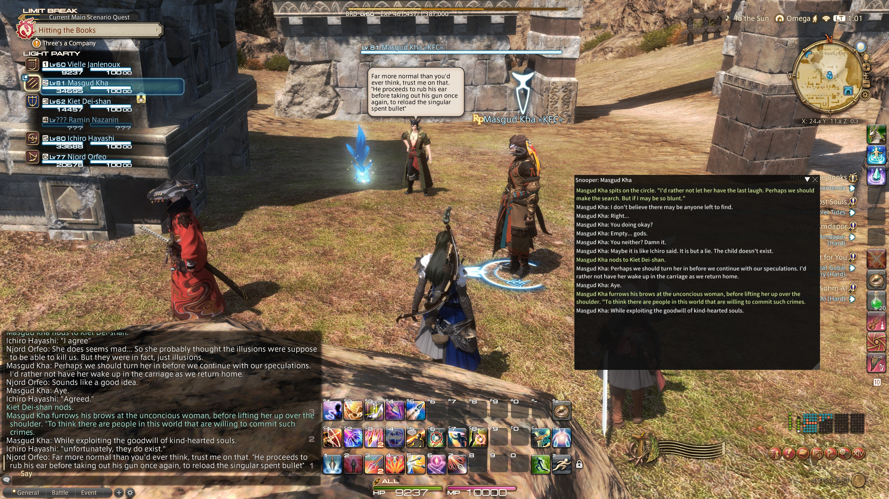

# Snooper

Dalamud plugin to help pay attention to individual speakers during large crowded RP events.

Adds a single slash command:

* `/snooper`: Opens a window that displays latest chat messages (say, shout, yell, emote) from the current target. The window automatically scrolls down when a new message from that player arrives.

Screenshot:

